# NLWeb State Machine Diagram

全面性系統狀態圖，涵蓋從連接建立到響應完成的完整生命週期。

---

## 1. 系統總覽 (Top-Level Overview)

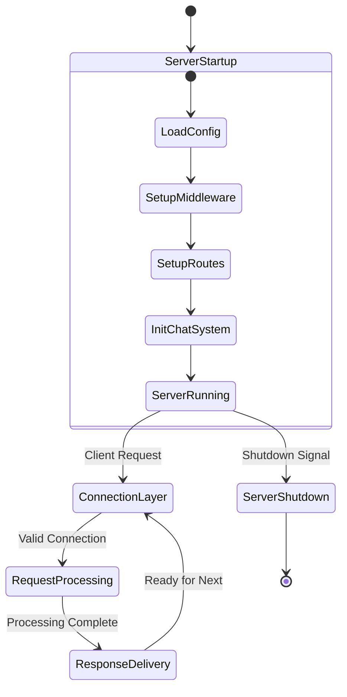

---

## 2. 連接層狀態 (Connection Layer)

### 2.1 HTTP 連接

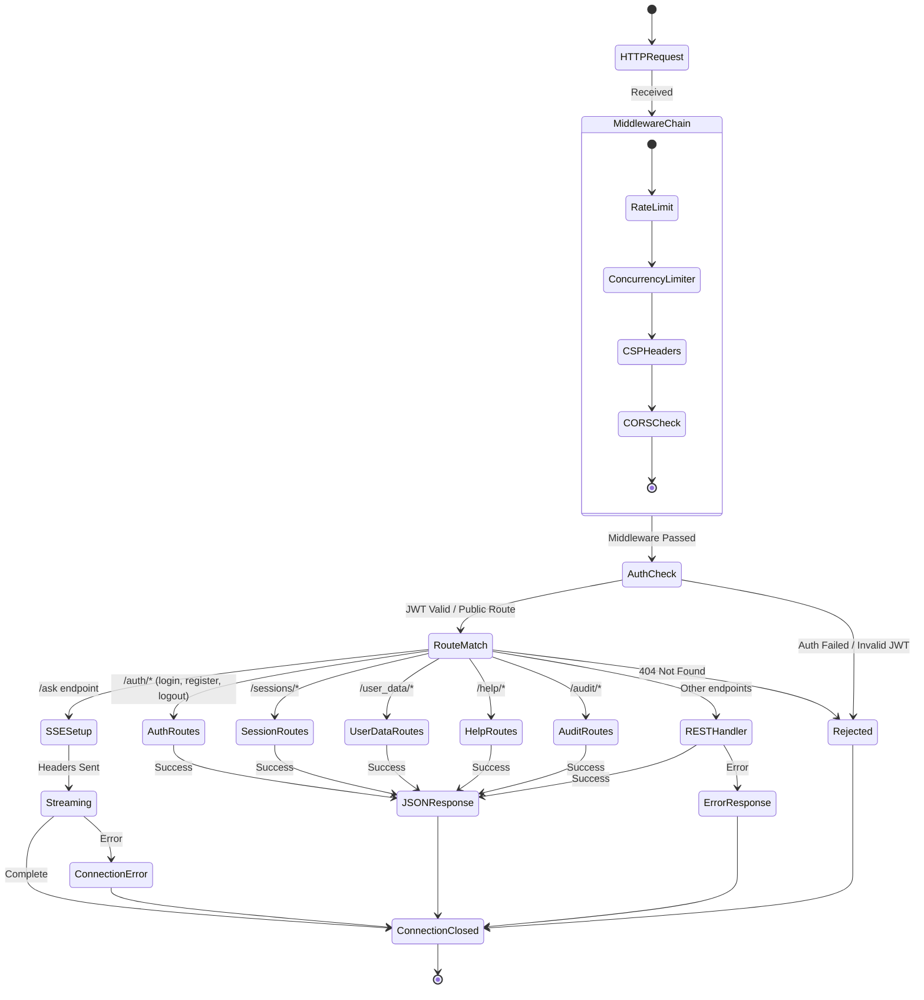

### 2.2 WebSocket 連接

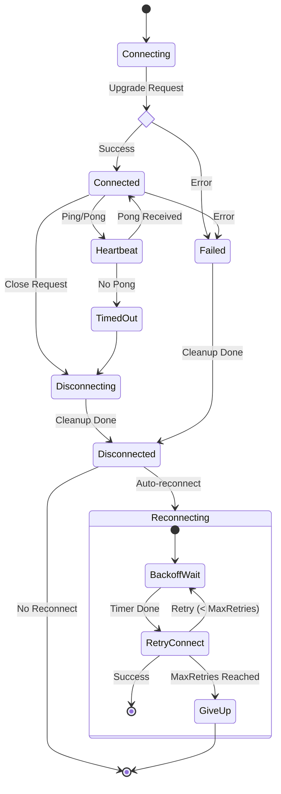

---

## 3. 請求處理狀態 (Request Processing - NLWebHandler)

```mermaid
stateDiagram-v2
    [*] --> HandlerInit

    state HandlerInit {
        [*] --> InitCoreParams
        InitCoreParams --> InitQueryContext
        InitQueryContext --> InitConversation
        InitConversation --> InitState
        InitState --> InitSync
        InitSync --> InitMessaging
        InitMessaging --> [*]
    }

    HandlerInit --> SendBeginResponse
    SendBeginResponse --> Prepare

    state Prepare {
        [*] --> ParallelPreChecks

        state ParallelPreChecks {
            state fork_prechecks <<fork>>
            state join_prechecks <<join>>

            [*] --> fork_prechecks
            fork_prechecks --> Decontextualize
            fork_prechecks --> QueryRewrite
            fork_prechecks --> TimeRangeExtract
            fork_prechecks --> ToolSelection
            fork_prechecks --> Memory

            Decontextualize --> join_prechecks
            QueryRewrite --> join_prechecks
            TimeRangeExtract --> join_prechecks
            ToolSelection --> join_prechecks
            Memory --> join_prechecks

            join_prechecks --> [*]
        }

        ParallelPreChecks --> PreChecksDone
        PreChecksDone --> Retrieval

        state Retrieval {
            [*] --> CheckSiteSupport
            CheckSiteSupport --> SkipRetrieval: No Embeddings
            CheckSiteSupport --> HybridSearch: Has Embeddings

            state HybridSearch {
                [*] --> ApplySourceFilter
                ApplySourceFilter --> PgBigmKeywordSearch: pg_bigm full-text
                ApplySourceFilter --> PgvectorSearch: pgvector ANN
                PgBigmKeywordSearch --> MergeResults
                PgvectorSearch --> MergeResults
                MergeResults --> [*]
            }

            HybridSearch --> TemporalFilter: Is Temporal Query
            HybridSearch --> SetResults: Not Temporal
            TemporalFilter --> SetResults
            SkipRetrieval --> SetResults

            SetResults --> [*]
        }

        Retrieval --> [*]
    }

    Prepare --> QueryDoneCheck

    state QueryDoneCheck <<choice>>
    QueryDoneCheck --> SendEndResponse: query_done = true
    QueryDoneCheck --> RouteQuery: query_done = false

    state RouteQuery {
        [*] --> CheckToolResults
        CheckToolResults --> ToolHandler: Has Handler Class
        CheckToolResults --> RankingPipeline: No Handler / Search Tool

        ToolHandler --> [*]
        RankingPipeline --> [*]
    }

    RouteQuery --> PostRanking

    state PostRanking {
        [*] --> CheckMapMessage
        CheckMapMessage --> CheckGenerateMode

        state CheckGenerateMode <<choice>>
        CheckGenerateMode --> Done: mode = none
        CheckGenerateMode --> Summarize: mode = summarize

        Summarize --> Done
        Done --> [*]
    }

    PostRanking --> CacheResults
    CacheResults --> SendEndResponse
    SendEndResponse --> [*]
```

---

## 4. 排序管道狀態 (Ranking Pipeline)

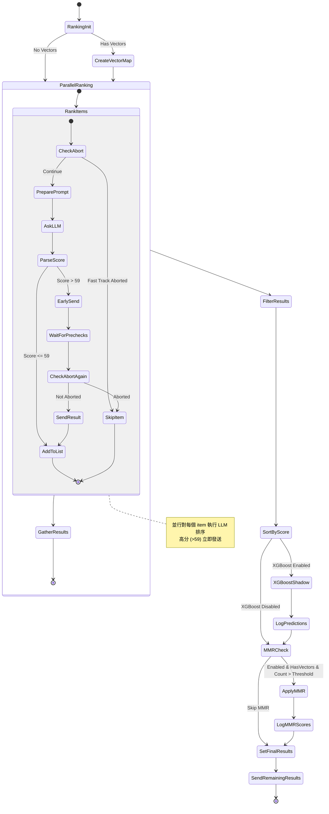

---

## 5. Reasoning 系統狀態 (Deep Research)

### 5.1 Deep Research Handler

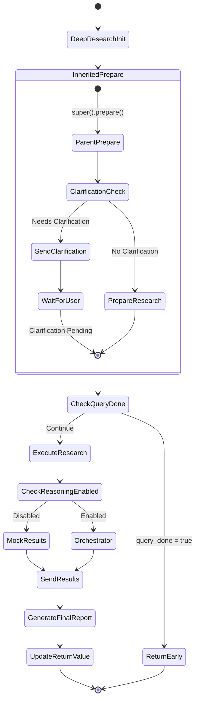

### 5.2 Actor-Critic Loop (Orchestrator)

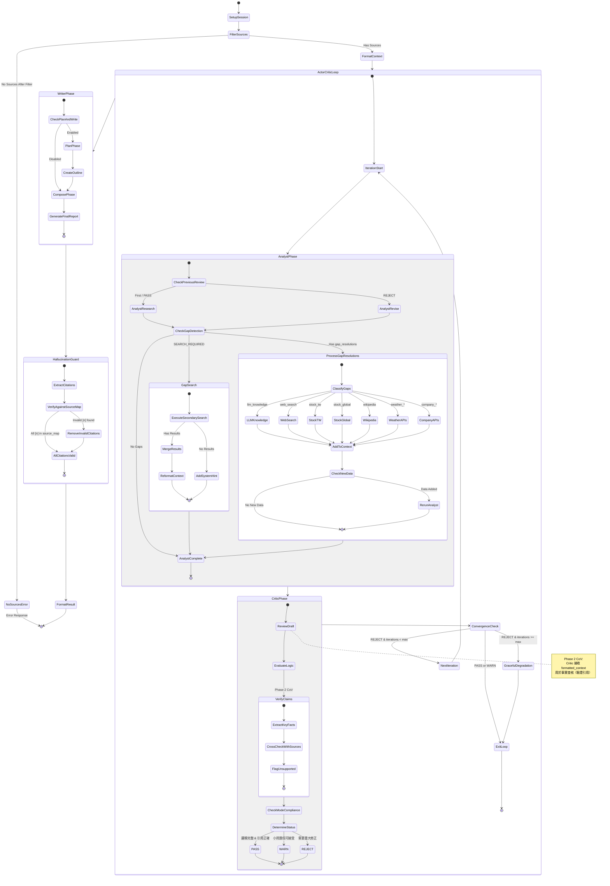

---

## 5.3 Major Upgrade — 計畫中的 Reasoning 擴充狀態

> 以下為 Major Upgrade 計畫中的新 states。使用 `classDef planned` 虛線標記。
> 詳見 `docs/in progress/plans/major-upgrade-plan.md`

```mermaid
stateDiagram-v2
    %% === Style Definitions ===
    classDef planned fill:#f0f0f0,stroke:#999,stroke-dasharray: 5 5,font-style:italic
    classDef active fill:#e6f3ff,stroke:#4a90d9

    [*] --> DeepResearchInit_v2

    state DeepResearchInit_v2 {
        [*] --> InheritedPrepare_v2: super().prepare()
        InheritedPrepare_v2 --> CheckQueryDone_v2

        state CheckQueryDone_v2 <<choice>>
        CheckQueryDone_v2 --> ReturnEarly_v2: query_done
        CheckQueryDone_v2 --> NonBlockingResearch: continue
    }

    %% === 📋 Non-blocking Research (asyncio.create_task) ===
    state NonBlockingResearch {
        note right of NonBlockingResearch
            📋 PLANNED: asyncio.create_task()
            Research 背景執行，chat 不等
            User 打字即 interrupt
        end note

        [*] --> CreateResearchTask
        CreateResearchTask --> ChatAvailable: task spawned
        ChatAvailable --> SoftInterrupt: user typing

        state SoftInterrupt {
            [*] --> SetInterruptFlag
            SetInterruptFlag --> AbortCurrentLLM: mid-stream abort
            AbortCurrentLLM --> WaitBoundary: wait next phase boundary
            WaitBoundary --> [*]
        }

        SoftInterrupt --> ResearchCancelled: hard abort
        ChatAvailable --> ResearchContinues: no interrupt
    }

    NonBlockingResearch --> ComposablePipeline

    %% === 🔄 Composable Pipeline (in progress) ===
    state ComposablePipeline {
        note right of ComposablePipeline
            🔄 IN PROGRESS: ResearchState dataclass
            驅動 4 個 composable phases
        end note

        [*] --> FilterAndPrepare: Phase 1

        FilterAndPrepare --> AssociationPhase: Phase 1.5 (📋 planned)

        %% === 📋 Association Phase (B→A→B' Loop) ===
        state AssociationPhase {
            note right of AssociationPhase
                📋 PLANNED: B→A→B' iterative loop
                Session-wide master B (Context Map)
            end note

            [*] --> BuildInitialB: 建立 Context Map
            BuildInitialB --> DeriveSearchPlan: B → A
            DeriveSearchPlan --> ExecuteSearchPlan: Execute A
            ExecuteSearchPlan --> RefineContextMap: Result → B'

            state RefineContextMap <<choice>>
            RefineContextMap --> DeriveSearchPlan: 不夠 → loop
            RefineContextMap --> AssociationDone: 夠了 → exit
            AssociationDone --> [*]
        }

        AssociationPhase --> ActorCriticLoop_v2: Phase 2

        %% === Phase 2 with Propose-Verify + Consistency Check ===
        state ActorCriticLoop_v2 {
            [*] --> AnalystPhase_v2
            AnalystPhase_v2 --> ProposeVerify: 📋 planned

            %% === 📋 Propose-Verify Pattern ===
            state ProposeVerify {
                note right of ProposeVerify
                    📋 PLANNED: LLM hypothesis
                    → Search/Scrape verify
                    → confirmed only
                end note

                [*] --> LLMPropose: hypothesis generation
                LLMPropose --> SearchVerify: Google Search + HTTP Scrape
                SearchVerify --> CheckVerified

                state CheckVerified <<choice>>
                CheckVerified --> Confirmed: source found
                CheckVerified --> Rejected_PV: no source
                Confirmed --> [*]
                Rejected_PV --> [*]
            }

            ProposeVerify --> CriticPhase_v2

            %% === Critic Phase with Consistency Check ===
            state CriticPhase_v2 {
                [*] --> StandardReview: existing review()
                StandardReview --> ConsistencyCheck: 📋 planned

                %% === 📋 Consistency Check (Critic 擴充) ===
                state ConsistencyCheck {
                    note right of ConsistencyCheck
                        📋 PLANNED: review_consistency()
                        diff(current B, initial B)
                        偏離 → 讀豹對話轉折
                    end note

                    [*] --> CheckMasterBDrift
                    CheckMasterBDrift --> DriftDetected: significant drift
                    CheckMasterBDrift --> NoDrift: aligned

                    DriftDetected --> EmitNarrativeTransition: 讀豹對話轉折訊息
                    EmitNarrativeTransition --> [*]
                    NoDrift --> [*]
                }

                ConsistencyCheck --> CriticDecision_v2

                state CriticDecision_v2 <<choice>>
                CriticDecision_v2 --> PASS_v2: pass
                CriticDecision_v2 --> REJECT_v2: reject
            }

            CriticPhase_v2 --> ConvergenceCheck_v2

            state ConvergenceCheck_v2 <<choice>>
            ConvergenceCheck_v2 --> AnalystPhase_v2: REJECT
            ConvergenceCheck_v2 --> ExitLoop_v2: PASS/WARN
            ExitLoop_v2 --> [*]
        }

        ActorCriticLoop_v2 --> WriterPhase_v2: Phase 3
        WriterPhase_v2 --> FormatResult_v2: Phase 4
        FormatResult_v2 --> [*]
    }

    ComposablePipeline --> EventBasedOutput

    %% === 📋 Event-Based Output ===
    state EventBasedOutput {
        note right of EventBasedOutput
            📋 PLANNED: 讀豹 Single Voice
            Event-based messages, 不做 streaming
        end note

        [*] --> ResearchMilestone
        ResearchMilestone --> ChatAgentFormat: 讀豹 voice
        ChatAgentFormat --> PushToConversation: reuse chat push
        PushToConversation --> [*]
    }

    EventBasedOutput --> [*]
    ResearchCancelled --> [*]
    ResearchContinues --> ComposablePipeline
    ReturnEarly_v2 --> [*]

    %% === Apply planned style ===
    class NonBlockingResearch planned
    class AssociationPhase planned
    class ProposeVerify planned
    class ConsistencyCheck planned
    class SoftInterrupt planned
    class EventBasedOutput planned
```

---

## 6. Chat 系統狀態 (Conversation Management)

### 6.1 WebSocket Manager

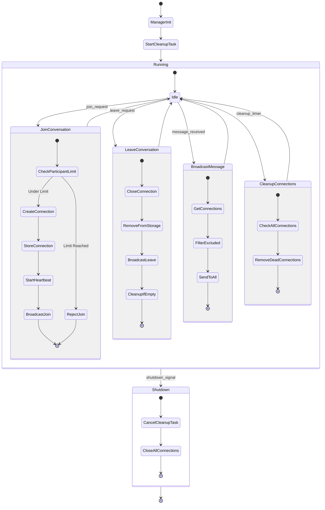

### 6.2 Conversation Manager

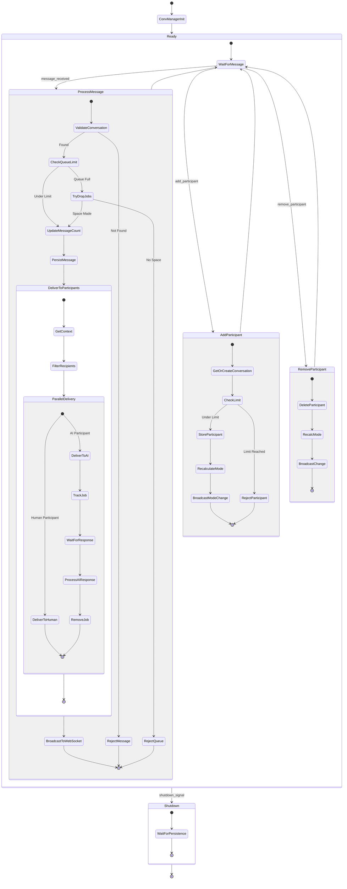

---

## 7. SSE 串流狀態 (Response Streaming)

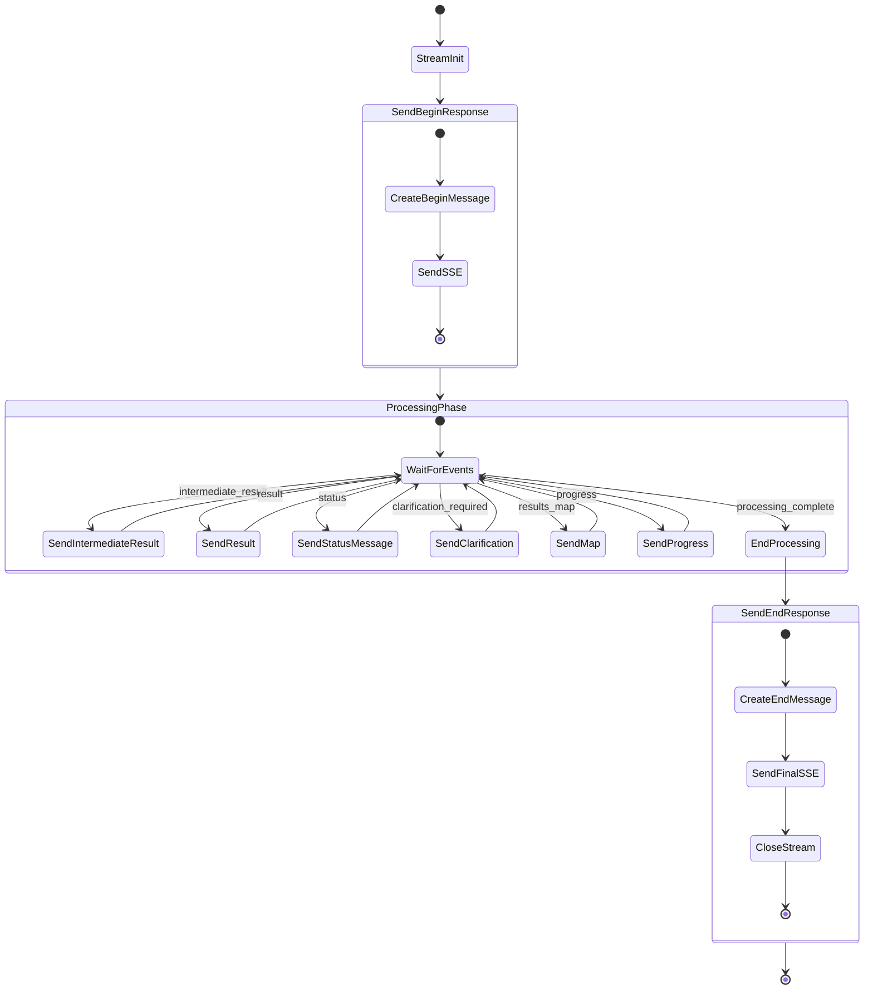

---

## 8. 錯誤處理狀態 (Error Handling)

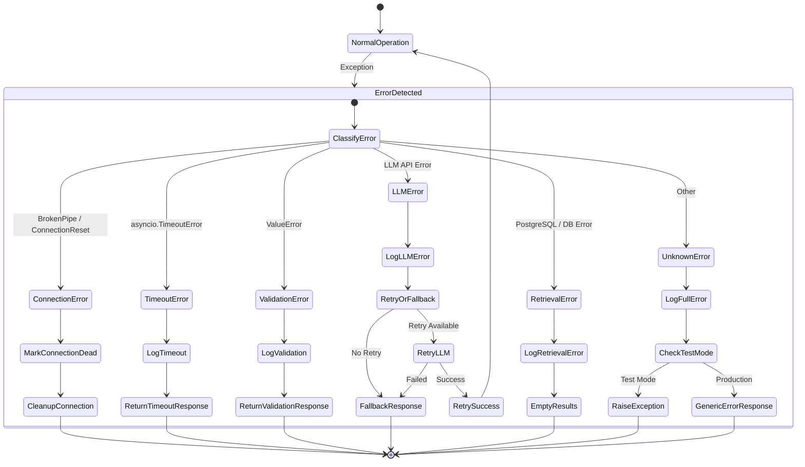

---

## 9. Handler State (NLWebHandlerState)

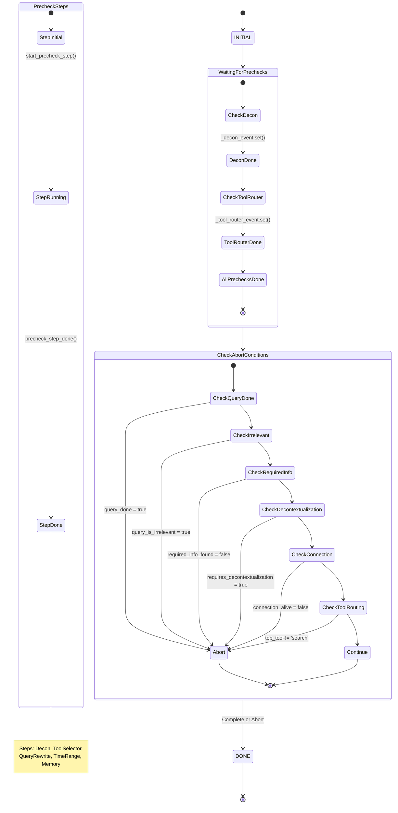

---

## 10. 完整生命週期 (Full Request Lifecycle)

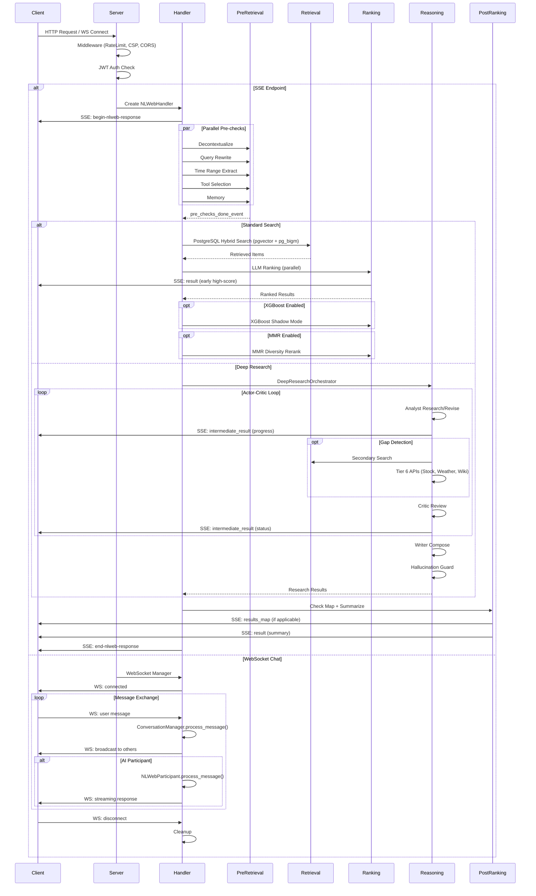

---

## 圖例說明

| 符號 | 意義 |
|------|------|
| `[*]` | 初始/終止狀態 |
| `<<choice>>` | 條件分支 |
| `<<fork>>` / `<<join>>` | 並行分叉/合流 |
| `state Name { }` | 複合狀態 |
| `-->` | 狀態轉換 |
| `-->>` | 非同步回應 |
| `classDef planned` (虛線) | 📋 Major Upgrade 計畫中的狀態 |
| `classDef active` (藍底) | 🔄 Major Upgrade 執行中的狀態 |

---

## 關鍵檔案對應

| 狀態區域 | 主要檔案 |
|----------|----------|
| Server Startup | `webserver/aiohttp_server.py` |
| Connection Layer | `webserver/middleware/cors.py`, `webserver/middleware/csp.py`, `webserver/middleware/rate_limit.py`, `webserver/middleware/concurrency_limiter.py` |
| Auth | `auth/auth_db.py`, `auth/auth_service.py`, `webserver/routes/auth.py`, `webserver/middleware/auth.py` |
| Session | `core/session_service.py`, `webserver/routes/sessions.py` |
| Request Processing | `core/baseHandler.py`, `core/state.py` |
| Pre-Retrieval | `core/query_analysis/*.py` |
| Retrieval | `core/retriever.py`, `retrieval_providers/postgres_client.py` |
| Private Docs | `core/user_data_processor.py`, `core/user_data_retriever.py`, `retrieval_providers/user_postgres_provider.py` |
| Ranking | `core/ranking.py`, `core/xgboost_ranker.py`, `core/mmr.py` |
| Reasoning | `reasoning/orchestrator.py`, `reasoning/agents/*.py` |
| Post-Ranking | `core/post_ranking.py` |
| Chat | `chat/conversation.py`, `chat/websocket.py` |
| SSE Streaming | `core/utils/message_senders.py`, `core/schemas.py` |
| Help Center | `webserver/routes/help.py` |
| Audit | `webserver/routes/audit.py` |
| **📋 Major Upgrade Plan** | `docs/in progress/plans/major-upgrade-plan.md` |

---

*更新：2026-04-13*
